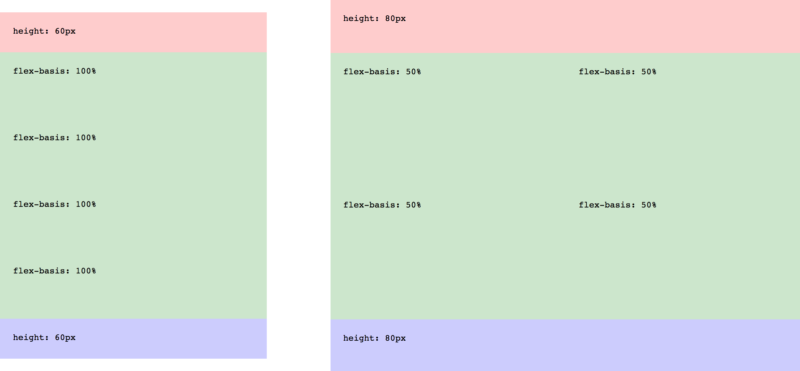

# Proof of Concepts

There are three proof of concepts (POC) that use the mocked language and demonstrate the design patterns. If you only look at one I’d recommend YouTube, since it's the most comprehensive.

## Facebook

The first project built with mono. It has an intricate UI which provided a good testing ground for [types]() and [modifiers]().

Credit to **Ben Hartley** for his [awesome design](https://dribbble.com/shots/1666016-Facebook-redesign).

## Responsive Grid

An example of using [discrete breakpoints]() to build responsive layouts.

## YouTube

The latest project built with mono. A good example of theming, responsiveness, interactions and stateful user interfaces.

*Light Theme*

*Dark Theme*