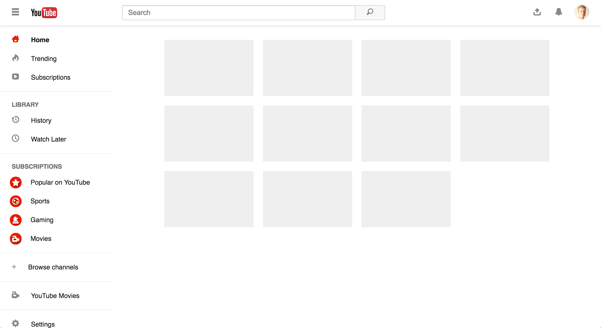

# YouTube

Light theme:

Dark theme:

## Development

To **run** this example locally:

- Clone repo `git clone https://github.com/callum-hart/mono.git`
- Navigate to example `cd mono/examples/youtube`
- Open `youtube.html` in browser

To **edit** this example locally:

- [Install Sass](http://sass-lang.com/install) *(if not already installed)*
- Clone repo & navigate to example *(same as in run)*
- Start a server `python -m SimpleHTTPServer`
- Open [localhost:8000/youtube.html](localhost:8000/youtube.html) in browser

## Further reading

You can read more [here](../../docs/examples/README.md).